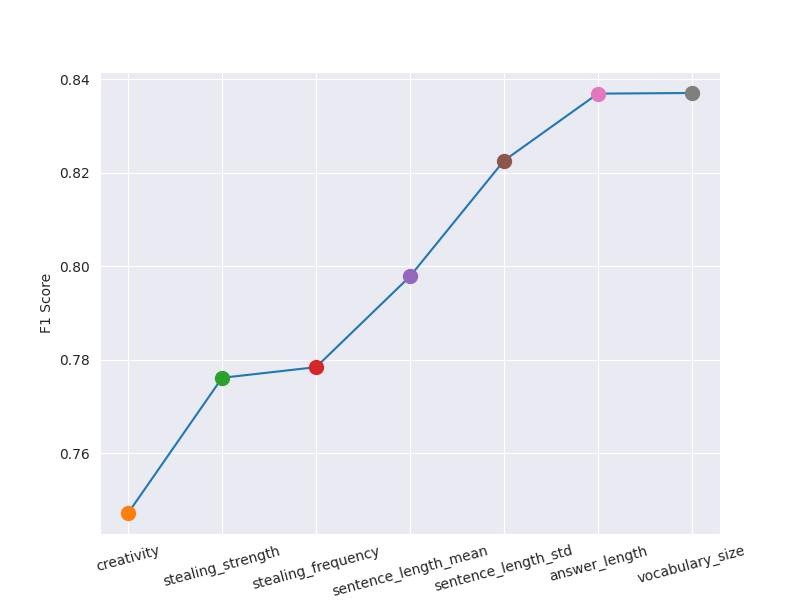

# Counter AI. Stackoverflow Answers GPT Detection

An API for identifying AI-generated responses to the given answers

## Background

ChatGPT is being an ongoing sensation and source of anxiety and heated debates for several months now. 
One of the main concerns is if AI can mimic humans too well, which can have different negative consequences. 
Among such consequences are plausible but incorrect answers that AI can give to people asking for help on the web.

Soon after ChatGPT became a thing, StackOverflow declared they would stop accepting answers from it. However, they didn't disclose how they were identifying them.
I thought it would be a great idea to research and implement my own classifier.

### How it differs from other AI-detection systems

The interesting part of my project is that it identifies AI-generated content given such context as human-generated question. 
This brings interesting opportunities for using different metrics that connect the question and the answer.

## Use Cases

Such an API can be used by automated premoderation systems that check if an answer was generated by a human or AI

## Problem statement
The objective of this project is to develop a production-ready classifier API that, given a pair of texts (question and answer), identifies if the answer was generated by the GPT-3 language model or by a human.

## Data collection
The training data (questions and answers) was collected using public API from StackOverflow.
The same questions were manually processed in ChatGPT to obtain AI-generated answers and add them to the training set.
The first iteration of the project was using public API from OpenAI that exposes GPT-3 language model.
This model is used behind the well-known ChatGPT AI chatbot.
However later it turned out that the data from API differs quite significantly from ChatGPT.

For the whole data collection and preparation flow please refer to the [data_collect](data_collect.ipynb), [toloka](./data/toloka.ipynb) and [prepare_data](prepare_data.ipynb) notebooks

### StackOverflow data
* To collect questions and human-generated answers I was using StackExchange API 2.2
  * Please refer to these scripts: 
    * [download_questions.py](download_questions.py)
    * [download_answers.py](download_answers.py)
* Only Stackoverflow site was used
* The most popular 10000 questions that had an accepted answer were fetched
* The accepted answer for every question was fetched as well

### GPT data 
* To collect the AI-generated answers I was using Toloka platform
* The stackoverflow question concatenated with its title was used as an input

## EDA and model training
For the complete flow please refer to the [eda_and_train.ipynb](eda_and_train.ipynb) notebook

I used the following approaches while training the model:
* Feature-based approach
* Distribution-based approach
* Combination of the previous two

### Feature-based Analysis
The intuition behind this approach is that GPT tends to use specific patterns in how it creates an answer based on a human-generated answer. For example, it seems to reuse whole sentences from the question 
The idea here is to engineer several numerical features and train a classifier model on them.

Main steps:
* Tokenizing the answers and question into separate words
* Stemming the tokens. This means reducing different forms of a word (i.e. plural and singular) to a singular token (stem)
* Creating ngrams (all different sequences of words of length `n`, where `n` varies from 2 to max)
* Creating numerical features
* Training classifiers (Logistic Regression, Random Forest and XGBoost)

#### Feature Engineering
##### Creativity
* Assumption: 
  * AI tends to use less original words in the answer comparing to the question than humans
* Features:
  * `creativity`: number of all unique words in the answer that are not present in the question, divided by the size of the answer

##### Vocabulary
* Assumption:
  * AI tends to use overall less unique words in the answer than humans
* Features:
  * `vocabulary_size`: number of unique words in the answer divided by the size of the tokenized answer

##### Stealing
* Assumption:
  * AI tends to reuse ("steal") in the answer more words and `ngrams` (sequences of words of length `n`) from the question than humans
  * Opposite to creativity, stealing shows how many words sequences were "stolen" from the question and taken into the answer. 
* Features
  * `stealing_strength`: maximum length (number of words) of a stolen ngram in the answer
  * `stealing_frequency`: total number of stolen ngrams divided by number of unique words in the answer

##### Answer length
* Assumption:
  * Even though the answer length is limited for humans and AI, the latter tends to create answers closer to some particular length than humans
* Features:
  * `answer_length`: answer length as number of characters

##### Sentence length
* Assumption:
  * AI tends to generate sentence by a specific pattern, different from humans'
* Features
  * `sentence_length_mean`: mean length of sentences in the answer
  * `sentence_length_std`: standard deviation length of sentences in the answer

#### Results


* The main increase in score comes from `answer_length` and `creativity`
* Despite the results of correlation matrix and histograms, `sentence_length_std` and `sentence_length_std` didn't show any use
* The following features were selected after trying cross-validation score:
  * `creativity`
  * `vocabulary_size` 
  * `stealing_strength`
  * `answer_length`
  * `sentence_length_mean`
* After fine-tuning, the best F1 score on the test data was:
  * 0.829
  * Winning classifier: XGBoost

### Distribution-based Approach
The intuition behind this approach is that GPT has a specific vocabulary and some terms (single words and ngrams) tend to appear in its answers more frequently than in humans'.
Main steps of this approach are:
* Tokenizing and stemming the answers
* Vectorizing the answers using `CountVectorizer`. 
* Applying Naive Bayes classifier (`ComplementNB`) to the vectors

#### Results
* The best `ngram_range` is (1, 4). That means that up to 4-words sequences have significance for the word frequency analysis
* The F1 score on the test data was:
  * 0.911


### Combined approach
Both previous approached showed already good scores (0.829 and 0.911)
However they are dealing with different aspects of data, so it was worth trying to combine them into 2-layered pipeline

Main steps:
* Stemming and vectorizing the answers
* Applying Naive Bayes to the vectors to predict probability
* Add this probability as another numerical feature to already created and selected features
* Train XGBoost on the new set of numerical features

#### Results
* The F1 score on the test data was:
  * 0.935
* It's a great improvement over both approaches, so this 2-layered pipeline will go into production

|    |         Feature based, <br/>Logistic Regression |         Feature based,<br/> XGBoost |   Feature based, <br/>Random Forest |       Distribution based,<br/>Naive Bayes |         Combined pipeline,<br/>XBGBoost + Naive Bayes |
|---:|-------------------------------------------:|-------------------------------:|------------------------------------:|------------------------------------------:|------------------------------------------------------:|
|  0 |                                      0.772 |                          0.829 |                               0.823 |                                     0.911 |                                                 0.935 |

## Deployment

The API implementing the trained model is built and dockerized using BentoML Framework.

## How to run the project

- install requirements:
  - ```pip3 install -r requirements.txt```
- run notebook: 
  - `jupyter-lab`
- run tests locally:
  - `pytest`
- train and save model: 
  - `python train.py`
- run service locally:
  - `bentoml serve service.py:svc`

## How to prepare model for deployment:
- Build model:
  - `bentoml build`
    - you'll see the output: `Successfully built Bento(tag="counter_ai_classifier:[bentoml_tag]")`
  - `bentoml containerize counter_ai_classifier:[bentoml_tag] --platform=linux/amd64`
  - Now you can find the model in your local docker:
    - `docker images`
- The image can now be pushed to ECR to be deployed as ECS service later, e.g.:
  - `docker tag [image id] [ecr url]`
  - `docker push [ecr url]`

## Production API
API deployed to AWS as a Fargate service and is accessible here:
https://api.counter-ai.illyge.com/

## Production Application
I've also deployed a very simple UI to more easily play with the API:
https://gpt-buster.streamlit.app/

## Credits
This is my capstone project for the machine learning bootcamp:
https://github.com/alexeygrigorev/mlbookcamp-code/tree/master/course-zoomcamp

## Next steps
1. Analyzing punctuation (e.g. question / exclamation marks) and capitalization
2. Using pretrained embeddings
3. Train a CNN
4. Try different data source, e.g. other sites of StackExchange